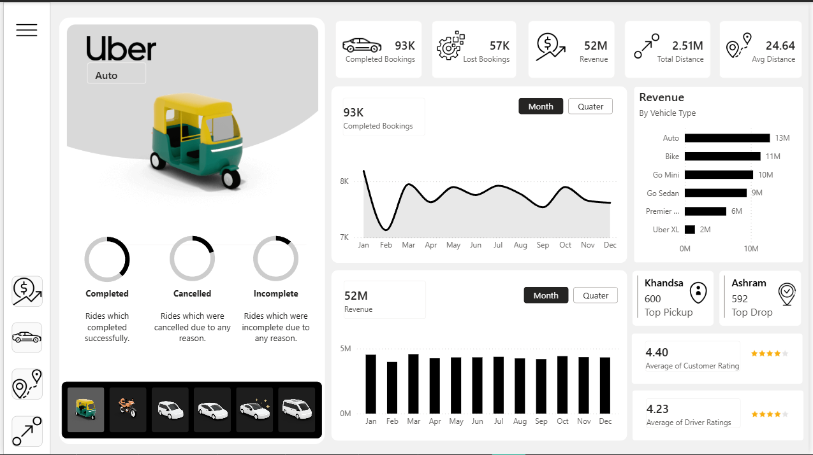
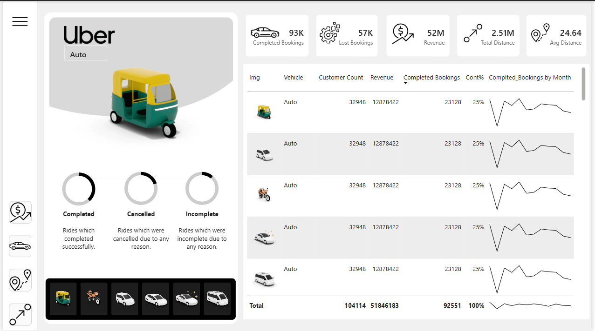
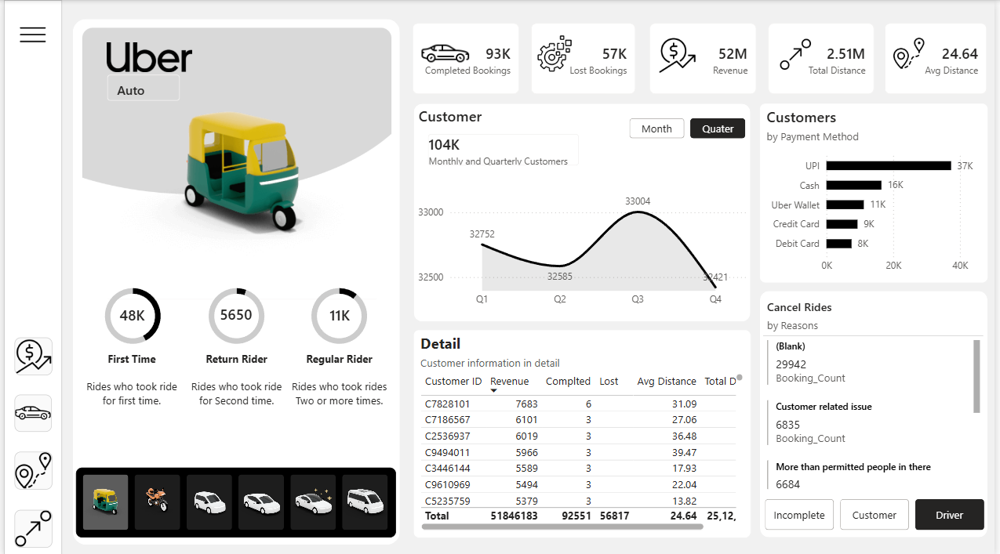
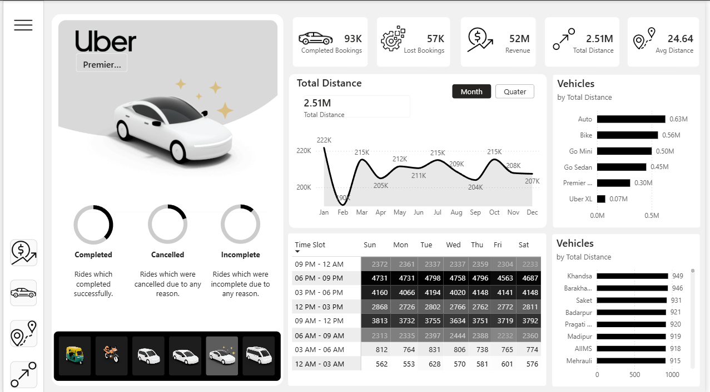

# 🚖 Uber Ride Analytics — Power BI Dashboard

> **Seamless Mobility. Smarter Rides. Data-Driven Decisions.**

A comprehensive Power BI dashboard analyzing Uber's ride operations across bookings, revenue, vehicle performance, rider behavior, and location intelligence — built on a structured data model with 150K+ booking records.

---

## 📊 Dashboard Preview

### 🏠 Home

> Landing page with navigation to all report sections.

---

### 📋 Overview

> High-level KPIs including completed bookings, lost bookings, revenue, total distance, and average distance. Features a time-slot heatmap and vehicle-wise distance breakdown.

**Key Metrics Visible:**
- ✅ 93K Completed Bookings
- ❌ 57K Lost Bookings
- 💰 ₹52M Revenue
- 🛣️ 2.51M Total Distance
- 📍 24.64 Avg Distance

---

### 🚗 Vehicle

> Performance comparison across vehicle types (Auto, Bike, Go Mini, Go Sedan, Premier, Uber XL) with completed booking trends by month and contribution percentages.

---

### 💵 Revenue

> Monthly and quarterly revenue trends, revenue split by vehicle type, payment method breakdown (UPI, Cash, Uber Wallet, Credit Card, Debit Card), and top customers by revenue.

---

### 🧑‍🤝‍🧑 Rider

> Customer segmentation into First Time, Return, and Regular riders. Includes quarterly customer trends, payment method preferences, a detailed customer table, and cancellation reason analysis.

---

### 📍 Location

> Top pickup and drop-off locations with ride counts and customer ratings (Average Customer Rating: 4.40 | Average Driver Rating: 4.23).

---

## 🗂️ Data Model


The report is built on a **star schema** with the following tables:

| Table | Description |
|---|---|
| `Uber` | Fact table — bookings, revenue, ratings, cancellations |
| `Calender` | Date dimension — Date, Month, MonthIndex, Quarter, QuarterIndex |
| `IMG` | Vehicle image mapping by Vehicle Type |
| `_Measures` | DAX measure table — Avg Distance, Booking Count, Booking Value, etc. |
| `Date Axis` | Dynamic axis toggle for time-series visuals |
| `Cancel Rides` | Cancellation reason dimension for drill-through |

---

## 📁 Repository Structure

```
uber-data-analysis-powerbi/
│
├── Dashboard/
│   └── Uber_dashboard.pbix        # Main Power BI file
│
├── Dataset/
│   └── uber.csv           # Raw dataset
│
├── Images/
│   ├── Home.png
│   ├── Overview.png
│   ├── Vehicle.png
│   ├── Revenue.png
│   ├── Rider.png
│   ├── Location.png
│   └── data_model.png
│
└── README.md
```

---

## ✨ Key Features

- **Interactive vehicle selector** — click any vehicle icon to filter all visuals
- **Month / Quarter toggle** — switch time granularity on charts dynamically
- **Ride status donut charts** — Completed, Cancelled, and Incomplete breakdown per vehicle
- **Cancellation drill-through** — filter by Incomplete, Customer, or Driver reasons
- **Time-slot heatmap** — identify peak demand windows across days of the week
- **Top pickup & drop locations** — ranked by booking volume with a location map

---

## 🛠️ Tools & Technologies


- **Power BI Desktop** — report authoring and data modeling
- **DAX** — custom measures for KPIs, dynamic axes, and bookmarks
- **Power Query (M)** — data transformation and calendar table generation

---

## 🚀 Getting Started

1. Clone this repository:
   ```bash
   git clone https://github.com/Player997/uber-data-analysis-powerbi.git
   ```
2. Open `Dashboard/Uber_dashboard.pbix` in **Power BI Desktop**.
3. If prompted, update the data source path to point to `Dataset/uber.csv`.
4. Refresh the data and explore the report.

---

## 📌 Insights Snapshot

| Metric | Value |
|---|---|
| Total Completed Bookings | 93,000 |
| Total Lost Bookings | 57,000 |
| Total Revenue | ₹52 Million |
| Total Distance Covered | 2.51 Million km |
| Average Trip Distance | 24.64 km |
| Top Vehicle by Revenue | Auto (₹13M) |
| Top Payment Method | UPI (37K transactions) |
| Peak Ride Window | 06 PM – 09 PM |
| Top Pickup Location | Khandsa (600 rides) |
| Average Customer Rating | 4.40 ⭐ |

---

## 🤝 Contributing

Pull requests are welcome. For major changes, please open an issue first to discuss what you'd like to change.

---
